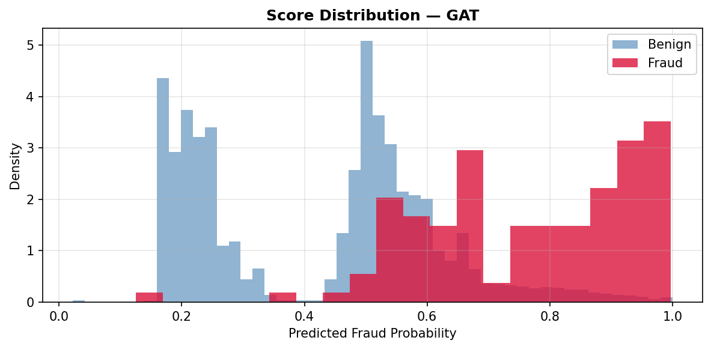
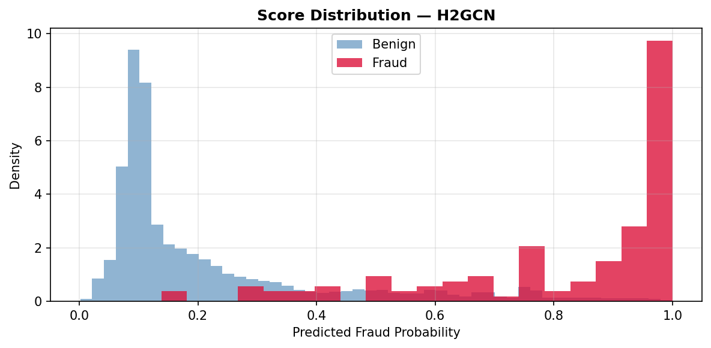
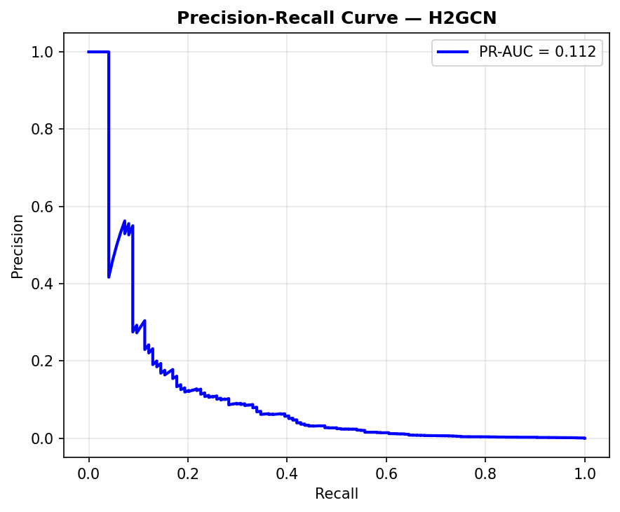
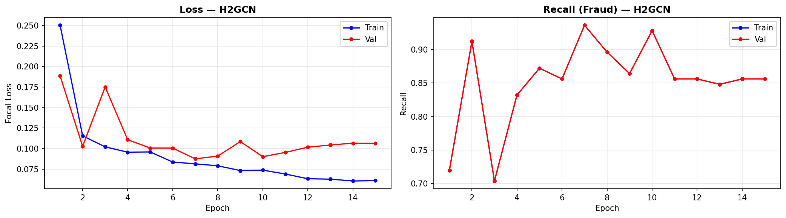

# Graph-Based Financial Intelligence
## Detecting Money Laundering with Heterophily-Aware Graph Neural Networks

> DS402 Final Project — Penn State University, April 2026  
> Moulik Jain

[](https://python.org)
[](https://pytorch.org)
[](https://pyg.org)
[](LICENSE)

---

## The Problem

Money laundering is a **structural** phenomenon. Fraudsters layer funds through chains of legitimate intermediary accounts — smurfing, roundtripping, shell companies. Standard GNNs that average over neighbor features wash out the fraud signal at exactly the nodes where it needs to be amplified.

This project identifies **heterophily** — fraudulent nodes connecting predominantly to legitimate ones — as the core failure mode of standard GNNs on financial graphs, and addresses it with **H2GCN** combined with a two-stage cascade classifier.

---

## Key Results

### IBM AML HI-Medium (2M transactions, 0.003% fraud rate)

| Model | ROC-AUC | PR-AUC | Recall |
|---|---|---|---|
| Random Forest (tabular) | 0.977 | 0.152 | 0.718 |
| XGBoost (tabular) | 0.972 | 0.511 | 0.581 |
| GraphSAGE | 0.947 | 0.042 | 0.798 |
| GAT | 0.902 | 0.005 | 0.960 |
| TGN | 0.974 | 0.136 | 0.623 |
| H2GCN | 0.960 | 0.113 | **0.903** |
| **H2GCN + XGBoost Cascade** | **0.993** | **0.595** | 0.548 |

**GAT** achieves 96% recall but generates **187,115 false positives** — 1,573 false alarms per real fraud detected. Operationally unacceptable.

**H2GCN** achieves **22× better PR-AUC** than GAT (0.113 vs. 0.005) with the only architectural change being ego-neighbor separation.

**The cascade** reduces false positives from 187,115 → 46,373 while achieving PR-AUC = 0.595 — a **119× improvement** over GAT standalone.

### Elliptic Bitcoin (zero-shot generalization, no retraining)
GAT: ROC-AUC = 0.906 | PR-AUC = 0.599 | Recall = 0.944

---

## Why Heterophily Matters

Under **GAT**: high fraud probabilities spread broadly to benign transactions because accounts neighboring a flagged node inherit inflated scores through message passing.

Under **H2GCN**: ego-neighbor separation anchors each node's representation independently, producing a sharp bimodal score distribution — fraud near 1.0, benign near 0.0.

The 22× PR-AUC gap between H2GCN and GAT on identical data, features, and training procedure isolates heterophily — not model capacity — as the bottleneck.

---

## Architecture

### H2GCN — Three Design Principles

**1. Ego-neighbor separation**  
Node features are projected to a hidden representation independently of any neighbor aggregation.

**2. Multi-hop aggregation**  
Separate SAGEConv layers aggregate 1-hop and 2-hop neighborhoods independently.

**3. Concatenative combination**  
Ego embedding and all hop-wise aggregations are concatenated (not averaged):

```
z_v = Linear([ego_v | h_v^(1) | h_v^(2)])
```

The fraud signal at node `v` cannot be washed out by its typically benign neighborhood because `ego_v` always contributes an unmodified self-representation.

### Two-Stage Cascade

```
[Train H2GCN] → [Extract node embeddings]
     ↓
For each edge (u, v):
  feature_vec = [embed_u | embed_v | raw_edge_features]
     ↓
[Train XGBoost on enriched feature matrix]
     ↓
[F1-optimal threshold on validation set]
```

XGBoost trained on raw edge features alone: PR-AUC = 0.511  
XGBoost trained on H2GCN embeddings + edge features: PR-AUC = 0.595  
The 8.4% gain is entirely attributable to graph structure encoded in the embeddings.

---

## Novel Features

### Structuring-Detection Features (smurfing behavior)

| Feature | Description |
|---|---|
| `near_threshold` | Binary flag for transaction amounts in [$8,500, $10,000) — just below the US Bank Secrecy Act reporting threshold |
| `structuring_burst` | Normalized per-account count of near-threshold outgoing transfers (clipped at 20, scaled to [0,1]) |
| `same_bank` | Binary flag for intra-bank transfers, which exhibit different laundering patterns than cross-institution transfers |

### Graph Structural Features

| Feature | Description |
|---|---|
| `pagerank` | Sparse power-iteration on SciPy CSR matrix (~40 iterations, no full adjacency materialization) |
| `kcore_proxy` | min(out_degree, in_degree) — cheap approximation of k-coreness identifying structurally central nodes |

---

## Repository Structure

```
aml-heterophily-gnn/
│
├── README.md
├── requirements.txt
├── LICENSE
├── .gitignore
│
├── aml_gnn_v2.py          # Full pipeline: feature engineering, GNN training, cascade, evaluation
│
├── data/
│   └── README.md          # Dataset download instructions (datasets not included due to size)
│
├── results/
│   ├── figures/           # Score distributions, PR curves, confusion matrix, loss curves
│
└── docs/
    ├── report.pdf         # Full paper
    └── presentation.pdf   # Final presentation slides
```

---

## Datasets

Neither dataset is included in the repository due to size and licensing.

### IBM AML HI-Medium
2,000,000 transactions | ~500,000 accounts | 0.003% fraud rate  
Download: [Kaggle — IBM AML Dataset](https://www.kaggle.com/datasets/ealtman2019/ibm-transactions-for-anti-money-laundering-aml)  
→ Place as `data/ibm/HI-Medium_Trans.csv`

### Elliptic Bitcoin Dataset
203,769 nodes | 234,355 directed edges | 9.76% illicit rate  
Download: [Kaggle — Elliptic Dataset](https://www.kaggle.com/datasets/ellipticco/elliptic-data-set)  
→ Place as `data/elliptic/`

---

## Installation

```bash
git clone https://github.com/Moulik04/aml-heterophily-gnn.git
cd aml-heterophily-gnn
pip install -r requirements.txt
```

**requirements.txt**
```
torch>=2.0.0
torch-geometric>=2.3.0
xgboost>=1.7.0
scikit-learn>=1.2.0
scipy>=1.10.0
pandas>=1.5.0
numpy>=1.23.0
matplotlib>=3.6.0
seaborn>=0.12.0
```

> Training was run on **Bridges2 PSC** (NVIDIA V100 32GB GPU). CPU execution is supported but significantly slower on the IBM dataset.

---

## Usage

```bash
# IBM AML — full pipeline (feature engineering → GNN training → cascade → evaluation)
python aml_gnn_v2.py --dataset ibm --model h2gcn

# Elliptic Bitcoin
python aml_gnn_v2.py --dataset elliptic --model gat

# Run all models for comparison
python aml_gnn_v2.py --dataset ibm --model all
```

> Adjust argument names above to match the actual flags in your script.

---

## Training Configuration

| Parameter | Value |
|---|---|
| Loss | Focal Loss (γ = 2) |
| Optimizer | Adam (lr = 1e-3) |
| Scheduler | Cosine annealing with warm restarts |
| Epochs | 15 |
| Batch size | 8,192 edges |
| Calibration | Platt scaling / isotonic regression |
| Threshold | F1-optimal on validation set |
| Split | 60/20/20 stratified edge-level |
| Hardware | Bridges2 PSC — NVIDIA V100 32GB |

---

## Results

### Score Distributions

GAT score distribution — fraud probability spreads broadly across benign transactions:



H2GCN score distribution — sharp bimodal separation after ego-neighbor separation:



### Precision-Recall Curve (H2GCN, IBM)



### Training Curves (H2GCN)



---

## Limitations

- IBM dataset is synthetic (calibrated to real banking patterns — distributional gap to live data is unknown)
- 46,373 false positives per 400K transactions (11.6% FPR) remains the primary operational challenge at bank scale
- Batch-trained pipeline cannot adapt to adversarial concept drift in real time

---

## Future Work

- **Temporal H2GCN**: Combine TGN's temporal memory with H2GCN's ego-separation
- **Explainability**: GNNExplainer for compliance-ready alert justifications (EU AMLD6)
- **Online learning**: Continual learning with drift detection
- **Multi-relational graphs**: Heterogeneous GNNs for wire, ACH, card, and cash edge types

---

## References

1. Hamilton et al. (2017). Inductive representation learning on large graphs. *NeurIPS*.
2. Veličković et al. (2018). Graph attention networks. *ICLR*.
3. Rossi et al. (2020). Temporal graph networks. *arXiv:2006.10637*.
4. **Zhu et al. (2020). Beyond homophily in graph neural networks. *NeurIPS*.** ← core paper
5. Weber et al. (2019). Anti-money laundering in Bitcoin. *KDD Workshop on Anomaly Detection in Finance*.
6. Altman et al. (2023). Realistic synthetic financial transactions for AML. *NeurIPS Datasets and Benchmarks*.
7. Lin et al. (2017). Focal loss for dense object detection. *ICCV*.
8. Chen & Guestrin (2016). XGBoost. *KDD*.

---

## Citation

```bibtex
@misc{jain2026aml,
  author = {Moulik Jain},
  title  = {Graph-Based Financial Intelligence: Detecting Money Laundering with Heterophily-Aware Graph Neural Networks},
  year   = {2026},
  school = {Pennsylvania State University},
  note   = {DS402 Final Project}
}
```

---

*Compute: Bridges2 PSC (Pittsburgh Supercomputing Center) — NVIDIA V100 32GB*
